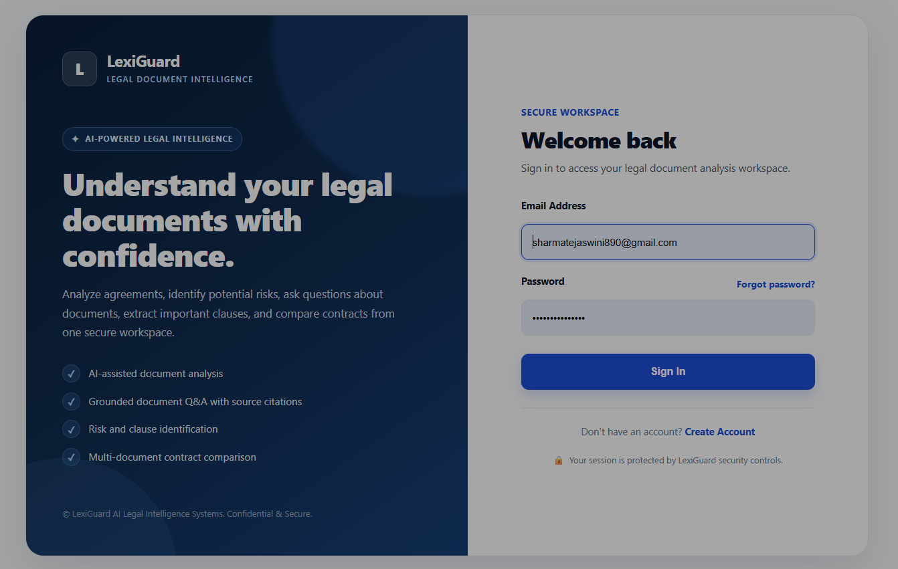
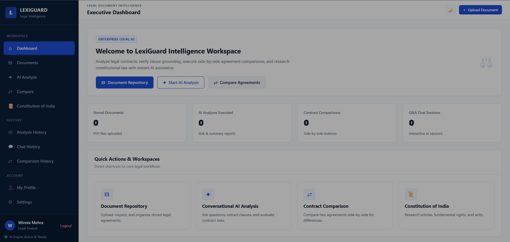
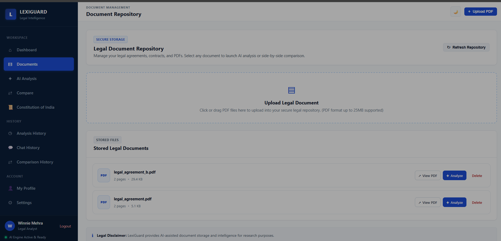
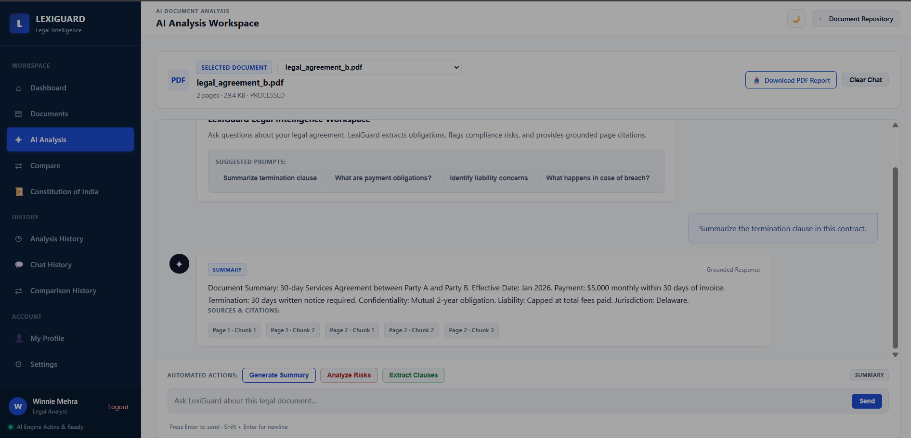
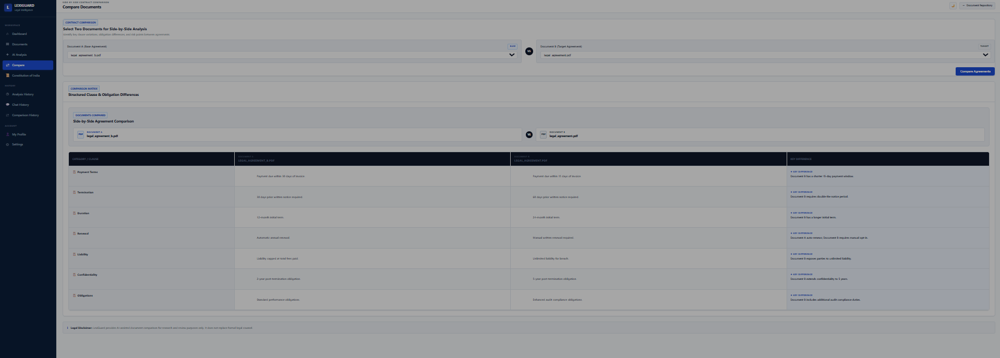
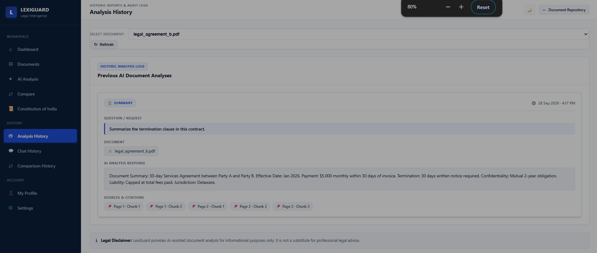
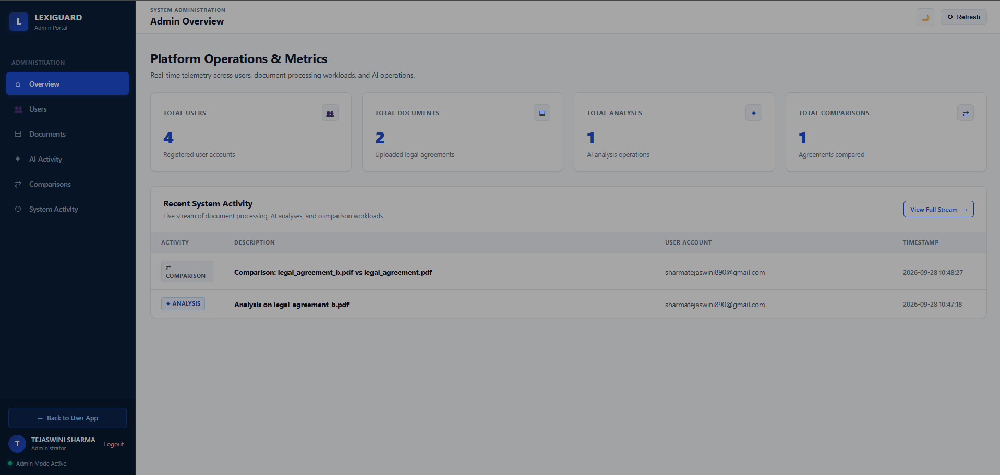

# LexiGuard — AI-Powered Legal Document Intelligence & Analysis System

LexiGuard is a local-first AI legal document intelligence platform designed to help users understand, analyze, and compare legal documents.

The system supports grounded document Q&A, document summarization, clause extraction, risk analysis, and side-by-side contract comparison. It uses document retrieval and structured AI workflows to provide responses based on the uploaded document content.

> [!IMPORTANT]
> **Legal Analysis Disclaimer:** LexiGuard provides AI-assisted document analysis for informational and educational purposes only. It is not a substitute for professional legal advice.

---

## 🌟 Overview & Problem Statement

Legal documents such as contracts, NDAs, software agreements, terms of service, and other legal documents can be lengthy and difficult to review manually.

Important clauses, obligations, potential risks, and differences between document versions may require significant time to identify.

**LexiGuard** addresses this problem through a local-first, retrieval-based architecture that combines document processing, information retrieval, LangGraph workflows, and configurable LLM providers.

### Key Characteristics

- **Local-First Processing:** PDF text extraction, text chunking, TF-IDF retrieval, and document processing run locally.
- **RAG-First Question Answering:** Document retrieval is performed before LLM generation so responses can be grounded in relevant document content.
- **Negative Retrieval Handling:** When sufficient document evidence cannot be retrieved, the system can return `Not found in the document.` instead of generating an unsupported answer.
- **Answer Caching:** Repeated questions can use the local answer cache instead of unnecessarily repeating the same LLM request.
- **Gemini / Mock Mode:** The system supports a configurable LLM provider and a deterministic mock mode for local development and testing.
- **LangGraph Workflow:** Different analysis tasks are routed through the appropriate workflow.
- **Structured History:** Q&A, document analysis, and document comparison are maintained separately.
- **PostgreSQL Persistence:** User data, document metadata, analysis history, chat history, and comparison information are persisted in PostgreSQL.
- **Local PDF Storage:** Uploaded documents are stored in the local `uploads/` directory.

---

# 🏗️ Architecture

```text
                                  +-----------------------+
                                  |      User / Client    |
                                  |      Web / API        |
                                  +-----------+-----------+
                                              |
                                              v
                                  +-----------------------+
                                  |     Flask Server      |
                                  |      Application      |
                                  +-----+-----------+-----+
                                        |           |
                         +--------------+           +--------------+
                         |                                         |
                         v                                         v
               +-------------------+                     +-------------------+
               |   Local Storage   |                     |   PostgreSQL DB   |
               |     uploads/      |                     |   lexiguard_db    |
               |    PDF Files      |                     | users / documents |
               +---------+---------+                     +-------------------+
                         |
                         v
               +----------------------+
               |   PDF Text Extraction|
               |       PyMuPDF        |
               +----------+-----------+
                          |
                          v
               +----------------------+
               |     Text Chunker     |
               | RecursiveCharacter    |
               |    TextSplitter       |
               +----------+-----------+
                          |
                          v
               +----------------------+
               |     Answer Cache     |
               |   Hash-Based Cache   |
               +----------+-----------+
                          |
                          v
               +----------------------+
               |    TF-IDF Retriever  |
               |   Cosine Similarity  |
               +----------+-----------+
                          |
                          v
               +----------------------+
               |   LangGraph Router   |
               |  Intent / Workflow   |
               +----+----+----+-------+
                    |    |    | 
          +---------+    |    |    +-------------------+
          v              v    v                        v
       [QA Node]     [Summary] [Clause] [Risk]   [Comparison]
          |              |      |      |              |
          +--------------+------+------+              |
                         |                             |
                         v                             v
              +----------------------+      +----------------------+
              |    Grounded RAG     |      | Structured Comparison|
              |   LLM / Mock Mode   |      |       Engine         |
              +----------+-----------+      +----------+-----------+
                         |                             |
                         +-------------+---------------+
                                       |
                                       v
                                +-------------+
                                | Final Result |
                                +-------------+
```

---

# 🔄 Document Processing Flow

```text
PDF Upload
     |
     v
Local File Storage
     |
     v
PDF Text Extraction
     |
     v
Text Normalization
     |
     v
Text Chunking
     |
     v
PostgreSQL Document Record
     |
     v
TF-IDF Vectorization
     |
     v
Query / Analysis Request
     |
     v
Relevant Chunk Retrieval
     |
     v
LangGraph Workflow
     |
     v
LLM / Mock Provider
     |
     v
Analysis Result
     |
     v
PostgreSQL History
```

---

# 🧠 AI Processing Pipeline

The document analysis workflow follows this pipeline:

```text
PDF Upload
     |
     v
PDF Text Extraction
     |
     v
Text Cleaning
     |
     v
Text Chunking
     |
     v
Document Storage
     |
     v
TF-IDF Vectorization
     |
     v
User Query
     |
     v
Cosine Similarity
     |
     v
Relevant Document Chunks
     |
     v
LangGraph Workflow
     |
     v
LLM / Mock Provider
     |
     v
Final Analysis
```

## Processing Components

| Component | Technology |
|---|---|
| PDF Processing | PyMuPDF |
| Text Chunking | LangChain RecursiveCharacterTextSplitter |
| Retrieval | TF-IDF |
| Similarity Calculation | Cosine Similarity |
| AI Workflow | LangGraph |
| AI Generation | Configurable LLM Provider |
| Database | PostgreSQL |
| File Storage | Local Filesystem |

---

# ✨ Key Features

## 📄 1. Legal Document Management

- Upload legal PDF documents
- Extract text from PDFs
- Normalize extracted text
- Split documents into smaller chunks
- Store document metadata
- Store PDFs locally
- View uploaded documents
- Delete documents

---

## 🤖 2. AI Document Analysis

LexiGuard supports multiple document analysis operations:

- Document summarization
- Question answering
- Clause extraction
- Risk analysis
- Relevant section retrieval
- Context-based responses

The analysis workflow uses retrieved document context before generating an AI response.

---

## 🔎 3. RAG-Based Question Answering

LexiGuard follows a retrieval-first approach for document Q&A.

```text
User Question
     |
     v
Query Processing
     |
     v
TF-IDF Similarity Search
     |
     v
Relevant Chunks
     |
     v
Evidence Check
     |
     +---- No sufficient evidence
     |             |
     |             v
     |     "Not found in the document."
     |
     +---- Relevant evidence
                   |
                   v
               LangGraph
                   |
                   v
              LLM / Mock
                   |
                   v
              Final Answer
```

This approach helps keep responses focused on the uploaded document.

---

## 📑 4. Document Summarization

LexiGuard can generate structured summaries from uploaded legal documents.

The summary workflow is maintained separately from conversational Q&A history.

---

## 📌 5. Clause Extraction

The system can identify and extract important clauses from legal documents.

This can help users review areas such as:

- Obligations
- Responsibilities
- Termination conditions
- Payment-related clauses
- Confidentiality
- Other relevant contractual provisions

---

## ⚠️ 6. Risk Analysis

LexiGuard provides AI-assisted analysis of potential risk areas within a document.

Retrieved document content is used as context for the analysis.

The results are stored separately under analysis history.

---

## 🔄 7. Document Comparison

Users can compare two legal documents side-by-side.

The comparison functionality can identify differences across structured legal categories and generate comparison results.

Comparison history is maintained separately from document analysis and chat history.

---

## 💬 8. AI Chat / Document Q&A

Users can interact with an uploaded document through the Ask LexiGuard interface.

Questions and responses are maintained under **Chat History**.

---

## 📚 9. Constitution Knowledge Base

LexiGuard includes a Constitution of India knowledge base for searching relevant constitutional information.

---

## 📊 10. PDF Reports

Analysis and comparison results can be converted into PDF reports using ReportLab.

---

## 🔐 11. Authentication and Role-Based Access

The application includes:

- User registration
- Login
- Logout
- Password hashing
- Session management
- Email OTP password recovery
- User roles
- Administrator access

---

# 📸 Screenshots

## Login



## Dashboard



## Document Management



## AI Document Analysis



## Document Comparison



## Analysis History



## Admin Dashboard



---

# 🛠️ Technology Stack

| Category | Technology |
|---|---|
| Programming Language | Python 3.14 |
| Backend Framework | Flask |
| Database | PostgreSQL |
| Document Storage | Local Filesystem |
| AI Orchestration | LangGraph |
| RAG | Retrieval-Augmented Generation |
| Retrieval | TF-IDF + Cosine Similarity |
| PDF Processing | PyMuPDF |
| Text Chunking | LangChain RecursiveCharacterTextSplitter |
| LLM Integration | Configurable LLM Provider / Gemini |
| Development LLM | Mock Provider |
| Authentication | Flask Sessions + Werkzeug Security |
| Email / OTP | Gmail SMTP |
| Report Generation | ReportLab |
| Frontend | HTML5, CSS3, JavaScript |
| Testing | Pytest |
| Configuration | python-dotenv |

---

# 📂 Project Structure

```text
lexiguard/
│
├── app.py
├── config.py
├── extensions.py
├── requirements.txt
├── README.md
├── .env.example
├── .gitignore
│
├── ai/
│   ├── cache.py
│   ├── embeddings.py
│   ├── graph.py
│   ├── llm.py
│   ├── prompts.py
│   ├── rag.py
│   └── retriever.py
│
├── aws/
│   ├── __init__.py
│   ├── ses_service.py
│   └── sns_service.py
│
├── database/
│   └── init_db.py
│
├── document_processing/
│   ├── pdf_loader.py
│   └── text_chunker.py
│
├── knowledge_base/
│   └── constitution.py
│
├── reports/
│   ├── analysis_report.py
│   └── comparison_report.py
│
├── routes/
│   ├── admin.py
│   ├── analysis.py
│   ├── api.py
│   ├── auth.py
│   └── documents.py
│
├── services/
│   ├── gmail_service.py
│   ├── local_storage_service.py
│   └── postgresql_service.py
│
├── static/
│   ├── css/
│   └── js/
│
├── templates/
│
├── screenshots/
│   ├── login.png
│   ├── dashboard.png
│   ├── documents.png
│   ├── analysis.png
│   ├── comparison.png
│   ├── history.png
│   └── admin-dashboard.png
│
├── test_documents/
│
├── tests/
│
└── uploads/
    └── .gitkeep
```

---

# 🗄️ Database & Storage

## PostgreSQL

LexiGuard uses PostgreSQL as the primary application database.

### Database

```text
lexiguard_db
```

### Main Tables

```text
users
documents
```

The `documents` table uses PostgreSQL `JSONB` for structured document-related information.

This can include:

- Document metadata
- Extracted content
- Document chunks
- Analysis history
- Chat history
- Comparison history

---

## Local File Storage

Uploaded PDF documents are stored in:

```text
uploads/
```

The corresponding document metadata and file path are stored in PostgreSQL.

### Storage Flow

```text
User Upload
     |
     v
Local uploads/
     |
     v
PDF Processing
     |
     v
PostgreSQL
     |
     v
AI / RAG Analysis
```

> **Note:** Amazon S3 and DynamoDB are not currently used as the application storage layer.

AWS SES/SNS components are retained only for notification-related functionality.

---

# 🔐 Authentication & Security

## Authentication

LexiGuard supports:

- User registration
- Login
- Logout
- Session management
- Password hashing
- Email OTP password recovery

## Authorization

The application supports role-based access.

Example roles:

```text
user
admin
```

Administrators can access the administrative dashboard and related functionality.

## File Security

Uploaded files are stored locally and document access is handled through the application's document ownership and storage logic.

## Credential Management

Sensitive values such as:

- Database passwords
- Secret keys
- API keys
- Email credentials

are stored through environment variables.

Real credentials should never be committed to GitHub.

---

# ⚙️ Installation

## Prerequisites

Make sure the following are installed:

- Python 3.x
- PostgreSQL
- Git
- pip

---

## Step 1 — Clone the Repository

```bash
git clone <repository-url>
cd lexiguard
```

---

## Step 2 — Create a Virtual Environment

For Windows PowerShell:

```powershell
python -m venv venv
```

Activate the environment:

```powershell
.\venv\Scripts\Activate.ps1
```

---

## Step 3 — Install Dependencies

```powershell
pip install -r requirements.txt
```

---

## Step 4 — Create the PostgreSQL Database

Create a PostgreSQL database named:

```text
lexiguard_db
```

Configure the PostgreSQL credentials in the `.env` file.

---

## Step 5 — Initialize the Database

```powershell
python database/init_db.py
```

---

# ⚙️ Environment Configuration

Create a `.env` file in the project root.

```ini
SECRET_KEY=your_secret_key

POSTGRES_HOST=localhost
POSTGRES_PORT=5432
POSTGRES_DB=lexiguard_db
POSTGRES_USER=postgres
POSTGRES_PASSWORD=your_password

LLM_PROVIDER=mock

GEMINI_API_KEY=your_gemini_api_key
GEMINI_MODEL=your_gemini_model
```

## LLM Provider Modes

### Mock Mode

For local development and testing:

```ini
LLM_PROVIDER=mock
```

This allows the application to run without making external LLM API calls.

### Gemini Mode

For live AI inference:

```ini
LLM_PROVIDER=gemini
GEMINI_API_KEY=your_gemini_api_key
GEMINI_MODEL=your_gemini_model
```

> **Security:** Never commit your `.env` file or real API credentials to GitHub.

---

# ▶️ Running the Application

Activate the virtual environment and run:

```powershell
python app.py
```

The Flask application will start locally.

Open the local application URL displayed in the terminal.

---

# 🔌 API Endpoints

| Method | Endpoint | Description |
|---|---|---|
| `GET` | `/dashboard` | Main dashboard view |
| `GET` | `/documents` | Document management and AI workspace |
| `GET` | `/compare` | Document comparison interface |
| `GET` | `/history` | Analysis history |
| `GET` | `/chat-history` | Chat history |
| `GET` | `/comparison-history` | Comparison history |
| `POST` | `/api/upload` | Upload PDF and store document |
| `GET` | `/api/documents` | List user documents |
| `DELETE` | `/api/documents/<id>` | Delete a document |
| `GET` | `/api/documents/<id>/history` | Retrieve document analysis history |
| `GET` | `/api/documents/<id>/chat-history` | Retrieve document chat history |
| `POST` | `/api/analyze` | Execute Q&A, summary, risk, or clause analysis |
| `POST` | `/api/compare` | Compare two legal documents |

---

# 🧪 Testing

LexiGuard uses **pytest** for automated testing.

## Run the Test Suite

```powershell
pytest
```

## Run Tests Using Mock LLM Mode

For tests that should not make external LLM calls:

```powershell
$env:LLM_PROVIDER="mock"
pytest
```

The test suite covers areas including:

- Authentication
- PostgreSQL services
- Document management
- Document analysis
- RAG and retrieval
- RAG negative retrieval handling
- Answer caching
- Document comparison
- Analysis history
- Chat history
- PDF reports
- Notification services

---

# 📈 Future Improvements

Planned improvements include:

- Semantic vector embeddings
- Improved semantic document retrieval
- OCR support for scanned PDFs
- Multilingual legal document analysis
- Advanced clause comparison
- Additional legal knowledge bases
- Improved audit logging
- Production deployment
- Support for additional document formats
- More advanced document citation and source tracing

---

# ⚠️ Disclaimer

LexiGuard is an AI-assisted legal document analysis project developed for educational, research, and productivity purposes.

The information generated by the application should not be considered legal advice.

Important legal decisions should always be reviewed by a qualified legal professional.

---

# 👩‍💻 Author

**Tejaswini Sharma**

GitHub:  
https://github.com/tejaswinisharma19

---

# 📄 License

This project is intended for educational and demonstration purposes.